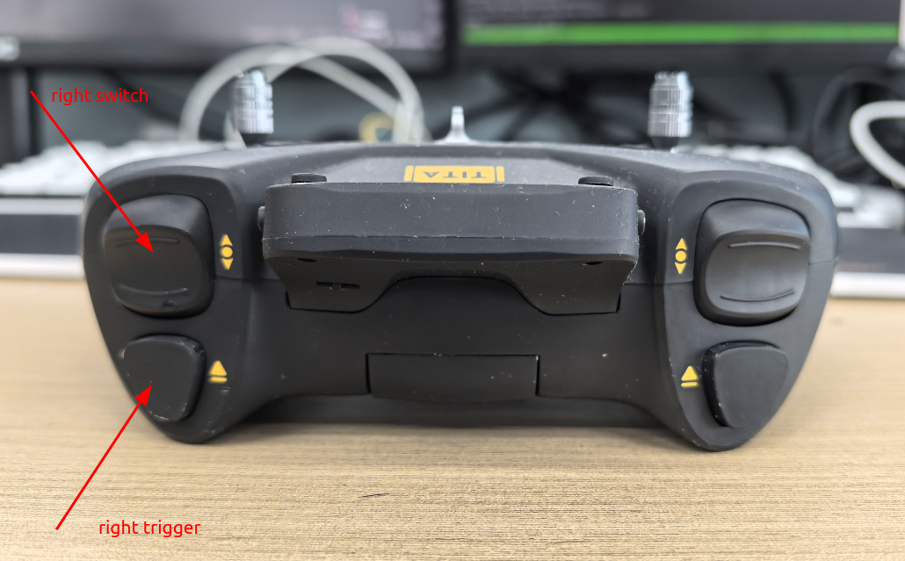
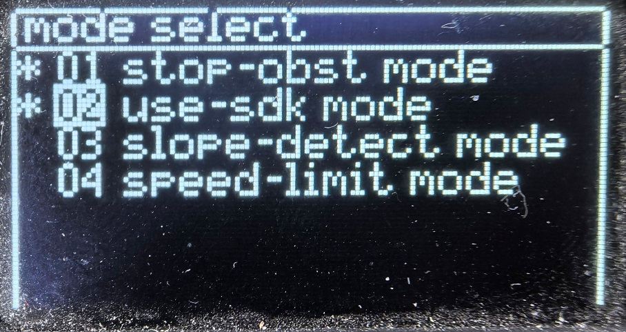

<p align="center"><strong>airbot_joy</strong></p>
<p align="center"><a href="https://github.com/${YOUR_GIT_REPOSITORY}/blob/main/LICENSE"></a>


</p>
<p align="center">
    语言：<a href="./docs/docs_en/README_EN.md"><strong>English</strong></a> / <strong>中文</strong>
</p>

    arx_x5使用BATAFPV遥控器（tita自带）来控制机械臂

## Build Package

```bash
# in robot environment
source /opt/ros/humble/setup.bash
source /opt/tita/ros2/setup.bash
colcon build --packages-up-to airbot_joy
```

添加在服务中自动启动，注意修改本包所在路径，以及
``` bash
sudo vim /etc/systemd/system/airbot_joy.service
# 添加以下内容
Description=ROS 2 Airbot Joy Launch

[Service]
Type=simple
ExecStart=/usr/bin/bash -c "source /opt/ros/humble/setup.bash && source /opt/tita/ros2/setup.bash && source /home/robot/manipulator_ws/install/setup.bash && ros2 launch airbot_joy airbot_joy.launch.py"
Restart=always
User=robot
WorkingDirectory=/usr/local
Environment="ROS_DOMAIN_ID=69"
Environment="ROS_LOCALHOST_ONLY=0"
[Install]
WantedBy=multi-user.target
```
启动并启用服务, 检查服务状态
``` bash
sudo systemctl start airbot_joy.service
sudo systemctl enable airbot_joy.service
sudo systemctl status airbot_joy.service
```

## Usage




right switch and right trigger combine to decide arm control method 
进入遥控器菜单，如果为`use-sdk mode`则可以控制机械臂，否则控制底座

组合：
- right switch `low` + right trigger `off`: 工具坐标系内xyz移动
- right switch `low` + right trigger `on`: 夹抓控制
- right switch `middle` + right trigger `off`: 关节123
- right switch `middle` + right trigger `on`: 关节456
- right switch `upper` + right trigger `off`: 基座坐标系内xyz移动
- right switch `upper` + right trigger `on`: 归为零位
